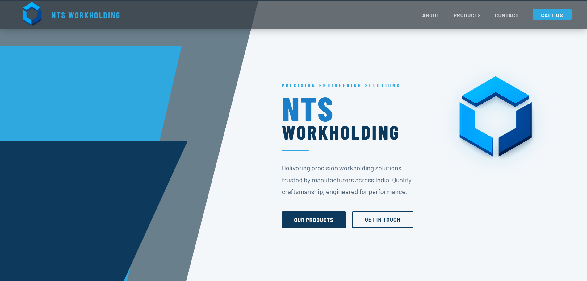
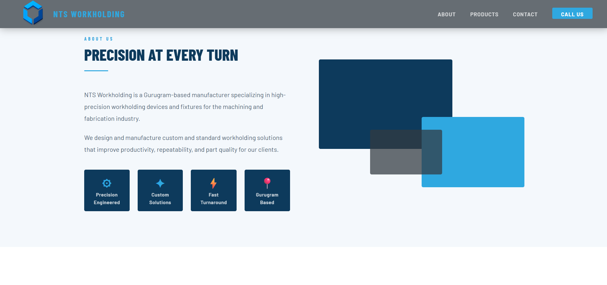
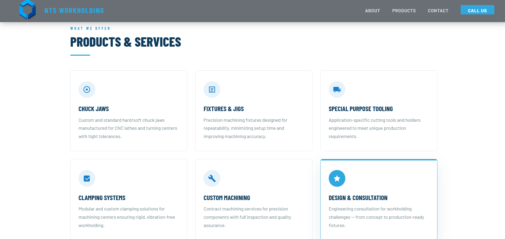
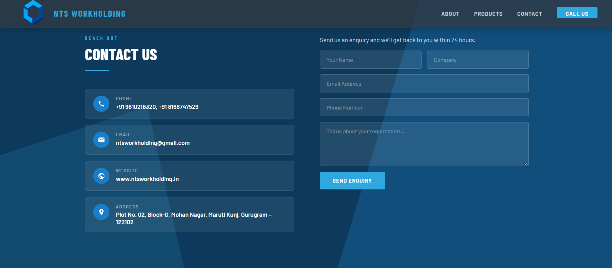

# NTS Workholding

A full-stack business website built from scratch for NTS Workholding, featuring a responsive landing page, contact form, and admin dashboard.

🌐 **Live Website:** [ntsworkholding.in](https://ntsworkholding.in/)

---

## ✨ Features

- Responsive landing page
- Product and service presentation
- Contact form
- Admin dashboard
- Backend API integration
- Database integration
- Responsive design across devices
- SEO configuration

---

## 🛠️ Tech Stack

### Frontend
- HTML5
- CSS3
- JavaScript
- GSAP

### Backend
- PHP
- REST APIs

### Database
- MySQL / MariaDB

### Deployment
- Netlify

---

## 📸 Screenshots

### Homepage

### About Us

### Products & Services

### Contact Us

---

## 🚀 Deployment

The website is deployed and publicly accessible:

**[Visit NTS Workholding](https://ntsworkholding.in/)**

---

## 💡 What I Learned

- Building a full-stack web application from scratch
- Connecting frontend interfaces with backend APIs
- Working with relational databases
- Designing responsive interfaces
- Implementing animations with GSAP
- Handling form submissions
- Deploying a production website
- Basic SEO and website configuration

---

## 📌 Project Status

**Live and deployed** 🚀
